<div align="center">
  
</div>

<div align="center">
  <a href="https://git.io/typing-svg">
    
  </a>
</div>

<br/>

<div align="center">
  <table>
    <tr>
      <td align="center" width="33%">
        <br/>
        
      </td>
      <td align="center" width="33%">
        <br/>
        
      </td>
      <td align="center" width="33%">
        <br/>
        
      </td>
    </tr>
  </table>
</div>

<br/>

<div align="center">
  
</div>

<div align="center">
  <a href="https://git.io/typing-svg">
    
  </a>
</div>

<div align="center">
  
  
  
  
  
</div>

<br/>

<div align="center">
  
</div>

<table align="center" width="100%">
<tr>
<td valign="top" width="55%">

### 👨‍💻 About Me

```cpp
#include <passion>
#include <caffeine>
#include <algorithms>

namespace andrew {

class Developer final {
public:
    constexpr auto name()       const { return "Andrew Dumin"; }
    constexpr auto role()       const { return "C++ Engineer"; }
    constexpr auto location()   const { return "Russia, UTC+3"; }
    constexpr auto motto()      const { return "Make it work, make it right, make it fast"; }

    std::array<std::string_view, 5> focus = {
        "⚡ High-Performance Computing",
        "🔐 Security & Privacy Tooling",
        "🧠 System Programming",
        "👁️  Computer Vision (OpenCV)",
        "🔧 Low-level Optimization"
    };

    std::array<std::string_view, 3> currently = {
        "🔍 Building static analyzers (Solidity, Android SDKs)",
        "📚 Exploring C++23 features",
        "🦀 Learning Rust for fun"
    };

    template<typename T>
    auto solve(Problem<T>&& p) -> Solution<T> {
        return think() | research() | iterate() | ship();
    }

    ~Developer() = default;
};

} // namespace andrew
```

</td>
<td valign="top" width="45%">

### 🎯 What Drives Me

<br/>

> 🔭 &nbsp; Building **lightning-fast** backend systems in modern C++

> 🔐 &nbsp; Writing **security & privacy tools** — SDK scanners, gas-inefficiency detectors, Android debloaters

> 🌱 &nbsp; Deep-diving into **C++23**, **concepts**, and **coroutines**

> ⚙️ &nbsp; In love with **CMake**, **clean code**, and **SOLID**

> 🧩 &nbsp; Daily **LeetCode** warrior — algorithms are my cardio

> 🤝 &nbsp; Open to **collaboration** on ambitious projects

<br/>

<div align="center">
  
</div>

</td>
</tr>
</table>

<div align="center">
  
</div>

### 🧰 Tech Arsenal

<div align="center">

<details open>
<summary><b>💻 &nbsp; Languages</b></summary>
<br/>

</details>

<details open>
<summary><b>📚 &nbsp; C++ Libraries & Frameworks</b></summary>
<br/>


</details>

<details open>
<summary><b>🔐 &nbsp; Security & Tooling</b></summary>
<br/>


</details>

<details open>
<summary><b>🗄️ &nbsp; Databases</b></summary>
<br/>

</details>

<details open>
<summary><b>🛠️ &nbsp; Tools & Platforms</b></summary>
<br/>

</details>

</div>

<div align="center">
  
</div>

### 📊 GitHub Analytics

<div align="center">
  <a href="https://github.com/DuminAndrew">
    
  </a>
  <a href="https://github.com/DuminAndrew">
    
  </a>
</div>

<div align="center">
  <a href="https://github.com/DuminAndrew">
    
  </a>
  <a href="https://leetcode.com/u/Dumin_Andrew/">
    
  </a>
</div>

<div align="center">
  
</div>

<div align="center">
  
</div>

### 📌 Featured Repositories

<div align="center">
  <a href="https://github.com/DuminAndrew/SDK-Sanitizer">
    
  </a>
  <a href="https://github.com/DuminAndrew/solidity-gas-slasher">
    
  </a>
</div>

<div align="center">
  <a href="https://github.com/DuminAndrew/BloatFree-Android">
    
  </a>
  <a href="https://github.com/DuminAndrew/LocalContext">
    
  </a>
</div>

<div align="center">
  <a href="https://github.com/DuminAndrew/QuizOwn">
    
  </a>
</div>

<div align="center">
  
</div>

### 💭 Random Dev Quote

<div align="center">
  
</div>

<div align="center">
  
</div>

### 🌐 Let's Connect

<div align="center">
  <a href="mailto:duminandrew@gmail.com">
    
  </a>
  <a href="https://leetcode.com/u/Dumin_Andrew/">
    
  </a>
  <a href="https://github.com/DuminAndrew">
    
  </a>
</div>

<br/>

<div align="center">
  <i>💡 <b>"First make it work, then make it right, then make it fast."</b> — Kent Beck</i>
</div>

<div align="center">
  
</div>

<div align="center">
  <sub>⭐ &nbsp; If you like what you see, consider starring my repos. Thanks for visiting! &nbsp; ⭐</sub>
</div>
